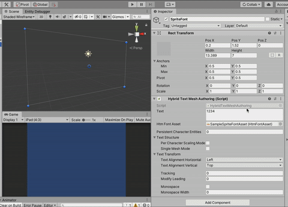

# ECS Hybrid Text Mesh

Use Transform systems and Hybrid Renderer to render pre-generated meshes of glyphs.

Tons of things here doesn't work yet or still wrong behaviour. The package is in development.

## Font asset

Font asset `HtmFontAsset : ScriptableObject` consists of a material and mesh per each character that you must preprocess in editor.
Each character has a quad mesh pre-generated with UV that lands on the right graphic. The generation is a context menu of the scriptable object. This way it is even possible to target text textures embedded in other sprite atlas, to unify draw call, unlike Text Mesh Pro which need an exclusive material.

Currently generation source are 2 `Sprite` both in multi mode : rects and bounds. You can duplicate your desired asset and make it a `Sprite` in order to define rect for each character. `Sprite` is purely for holding generation data, the actual thing that will be used is the material.

Name each rect as a single character and it will be interpreted by the converter as a UV area for that character inside your string. Drag all sprite rects into rect and bounds field on the asset. Before generation, assign `baseSize` in the font's metrics. Then right click the Inspector of the asset to use preprocess context menu.

- The "rect" `Sprite` is used for generating mesh, which the height is fixed at `baseSize` and width following the shape of rects in the sprite. To enable single mesh mode, all "rect" must be of the same size. (Therefore thin glyphs will need empty space around it.) If you satisfy this condition after generation a check mark will appear on "Single Mesh Support".
- The "bounds" `Sprite` is expected to contain a tightly fitted rect to the glyph's graphic. They are all expected to be surrounded by their "rect" counterpart. The bounds will be translated into positioning offset that it looked like the mesh has no surrounding space around them. (Exchanged with overdraw because the glyph's meshes are now overlapping.)

Metrics other than base size are as if the base size is 1. If you change the base size later there is no need to update ascender, descender, and leading.

Meshes are generated with size according to base size and baked into the font asset file. The size is embedded in the mesh because it allows you to not having any `NonUniformScale` on your glyphs if you could live with exactly this size. (Though there is a less efficient mode that add this component.)

## How it works

Programmatically please see the authoring component and mimic what it is doing. Pay attention to how it migrate stuff from `RectTransform` as `Rect` to use together with `Translation`.

After setting up a single "glyph parent entity" correctly, systems will activate and create 1 `Entity` per glyph as a child of that (transform-wise with `Parent`, and package specific dynamic buffer `GlyphEntityGroup`) and set them up so Hybrid Renderer works.

## Layout

All characters are registered in parent's `GlyphEntityGroup`. Parent loop over this once after creation to layout them. There is nothing to do with `LinkedEntityGroup`. 

The system will layout all spawned glyphs once and tag `LayoutCompleted`. If you want to animate each character, you can remember transforms of each character after the layout had finished as a base then you are free to change any TRS as a delta to values you remembered.

## Glyph and layout refreshes

Refreshes can occurs in 2 levels. If you change text or other important parameters all character meshes are cleaned up and spawned again, plus layout once again. (Including appending text to old text, it discards an entire line.) But there are some parameters like text alignment that won't cause complete clean up, but just re-layout refresh.

## Authoring component

Currently the name is `HybridTextMeshAuthoring`.

- It will add `RectTransform` together so you can define bounds similar to Text Mesh Pro.
- It has a number box to specify how many entities to add into the character buffer on "persistent character entity mode" while conversion take place as an additional entities. When this number is 0 the persistent mode is off.

## Limitations

- Uses `NativeString512`, size is not unlimited.
- Nothing else other than explained. It is essentially just "render a part of texture with preprocessed mesh's UV".

## Special modes

### Persistent character entity mode

With this mode off, the content of `CharacterEntityGroup` will be generated according to your string, so that should be empty when you make a text.

With this mode on, you must prepare the content of `CharacterEntityGroup` yourself. The text is now length limited to how many you prepared. The advantage of this is that you can now include all the characters in other entity's `LinkedEntityGroup` reliably as they won't be regenerated ever. Good for chain `SetEnable`. Look in `ArchetypeCollection.cs` to see all required components of each character.

Persistent mode seems to not work well with Subscene due to how live link diff work.

### Per glyph scaling mode

Normally it will not add `NonUniformScale` on any of your glyph, and if you need different scaling you can always use `NonUniformScale` on their `Parent`.

With this mode all generated glyph entities will individually have `NonUniformScale`, which this package will not use. It adds more potential from your own code such as pulsing per-character animation.

### Single mesh mode

This is a WIP mode not usable currently but there are stubs left all over the place. Normally (both this package and Text Mesh Pro) each character has different mesh. Only the same character of the same font are in the same batch in `BatchRendererGroup` that Hybrid Renderer uses.

The plan to push performance further is to try using only 1 mesh to render all glyphs which it allows geometry instancing. Because each mesh must also have the same UV, instead I would like to try using material property block to vary offset of texture instead to slide the texture into the fixed "UV window". This tactics only work if the character textures were prepared in equal size.

That maybe done once URP support for `[MaterialPropertyBlock]` lands as an optimization for specialized use case. (e.g. A lot of animated damage numbers or running scores, which consisting of only digits and rather need performance more than flexibility/ease of preparation.)

